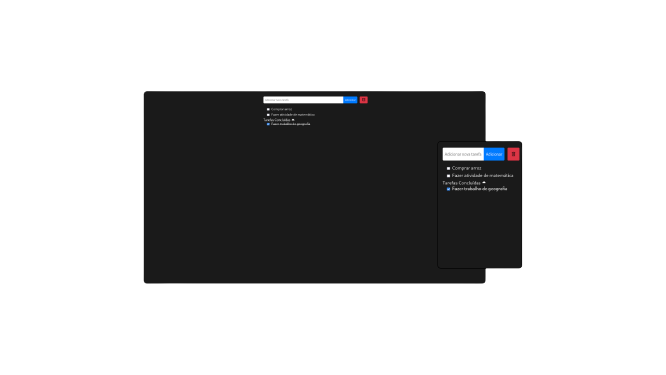

<h1 align="center"> To-do List </h1>

Este é um site de To-do list ou lista de afazeres feito para você amazenar tarefas para serem feitas ao longo dos dias, semanas ou dos meses. 

  <a href="#-tecnologias">Tecnologias</a>&nbsp;&nbsp;&nbsp;|&nbsp;&nbsp;&nbsp;
  <a href="#-projeto">Projeto</a>&nbsp;&nbsp;&nbsp;|&nbsp;&nbsp;&nbsp;
  <a href="#-layout">Layout</a>&nbsp;&nbsp;&nbsp;|&nbsp;&nbsp;&nbsp;
  <a href="#memo-licença">Licença</a>

  

 

  

## 🚀 Tecnologias

Esse projeto foi desenvolvido com as seguintes tecnologias:

- HTML e CSS
- JavaScript
- Git e Github

## 💻 Projeto

O To-do list é uma lista de tarefas online.

## :memo: Licença

Esse projeto está sob a licença MIT.

---

Feito com ♥ by Érick
